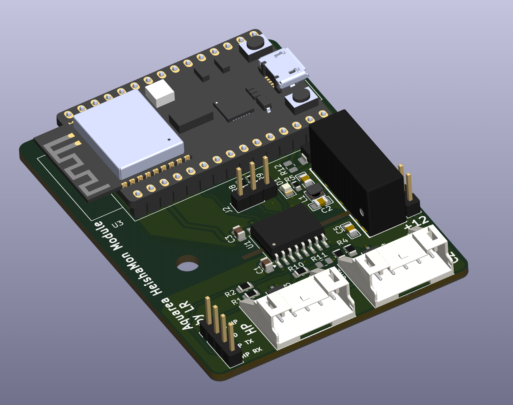

# HeishaMon Aquarea
### Alternative Galvanically Isolated Design

This repository contains an alternative schematic for integrating with Panasonic Aquarea heat pumps using the **HeishaMon** firmware.

## ⚠️ Disclaimer

> This design is **experimental** and has **not yet been tested**.  
> The first hardware version is expected to arrive within a few days.  
> Use at your own risk and feel free to open issues or discussions for feedback and improvements.

## 🛠️ Key Features

- **Galvanically isolated design**  
  Ensures complete electrical isolation from the heat pump for improved safety and reliability.

- **Based on ESP32-C3-DevKitC-02 (official Espressif dev module)**
   
- **Flexible power supply configuration**  
  The board is designed to support different power input scenarios for testing.  
  By default, it uses **12V @ 250mA** to ensure higher available power and better stability.

## 🔧 Firmware Notes

> This board uses different GPIOs than the original HeishaMon design.  
> You **will need to modify the `#define` values** in the firmware source accordingly to match this schematic.  

## 🧩 Usage

The design is tailored for experimenting with various supply options and integration methods, while maintaining full galvanic isolation of the communication lines with the heat pump.

## 📁 Contents

- `export/`: The gerber files

## 📌 Notes

- Intended to be used with HeishaMon firmware (see: https://github.com/Egyras/HeishaMon/)
- Verify jumper settings and isolation components before connecting to the heat pump.

